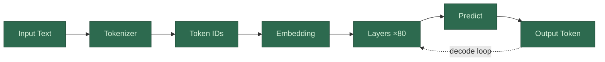

When you send a message to an LLM like ChatGPT or Claude, here's what happens at a high level:

1. Your message, along with any previous messages in the conversation (the "context"), gets converted from human-readable text into numbers — specifically, a sequence of numerical vectors. This step is called *[tokenization](/llms/what-happens/tokens/tokenization/)* and *[embedding](/llms/what-happens/embeddings/)*.
2. Those numbers flow through the model — a stack of mathematical layers that transform them, over and over, each layer refining the model's internal representation of what you said and what should come next.
3. The final layer outputs a [probability distribution](/llms/what-happens/embeddings/model-layers/final-vector-to-token/): a ranked list of every possible next word (technically "token") the model could produce, with a score for how likely each one is.
4. A token is selected from that distribution, appended to the sequence, and the whole process repeats — the model now takes everything so far (your messages + its own partial response) and predicts the next token again. This loop continues until the model produces a [stop signal](/llms/what-happens/embeddings/model-layers/final-vector-to-token/stopping/).

That's it. Every response you've ever gotten from an LLM was generated one token at a time, left to right, by a system that only knows how to do one thing: predict what comes next.
