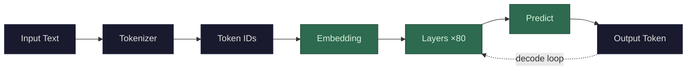

A vector is just a list of numbers. That's it. The list `[0.2, -1.5, 0.8]` is a three-dimensional vector. The word "dimensional" sounds intimidating, but all it means is how many numbers are in the list — three numbers, three dimensions.

What makes vectors useful is that you can treat that list of numbers as a *position in space*. A 2D vector like `[3, 4]` is a point on a flat grid — 3 units along the x-axis, 4 along the y-axis. A 3D vector adds a z-axis. You can't visualize it past three dimensions, but the math doesn't care — it works exactly the same way in 100 dimensions or 8,192 dimensions. You're just describing a point in a space with that many axes.

In the context of LLMs, vectors are how the model represents *meaning*. When your text gets converted into vectors (step 1 from the root), each token becomes a high-dimensional vector — Llama 3 70B uses 8,192 dimensions. Each dimension doesn't have a clean human label like "formality" or "noun-ness." Instead, the model learned during training that *this particular arrangement of numbers* is a useful way to represent what this token means *in context*. Two tokens with similar meanings end up with vectors that are close to each other in that high-dimensional space. Two tokens with different meanings are far apart. The entire model operates by moving these vectors around — transforming, rotating, and combining them through its layers — until the final vector encodes enough information to predict what comes next.
