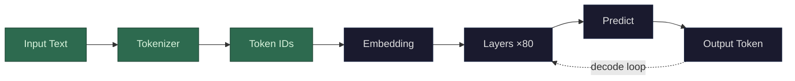

A token is the unit of text that an LLM actually works with. It's not a word, not a character — it's somewhere in between. The model has a fixed vocabulary of tokens (typically 30,000–100,000 of them), and every piece of text you send gets split into a sequence of tokens from that vocabulary before the model sees it.

Common words like "the" or "hello" are usually a single token. Less common words get broken into pieces: "unbelievable" might become `["un", "believ", "able"]` — three tokens. Very rare words, technical jargon, or typos get split down further, sometimes to individual characters. Spaces, punctuation, and newlines are tokens too.

This splitting is done by a *tokenizer* — a fixed lookup table that was built before training. The tokenizer doesn't understand meaning; it was constructed using a statistical algorithm (usually Byte Pair Encoding or BPE) that looked at a huge corpus of text and figured out the most efficient set of subword chunks to represent it. Frequent character sequences get their own token. Rare sequences get assembled from smaller pieces.

Why does this matter? Because the model doesn't see your words — it sees a sequence of token IDs (integers). "Hello, how are you?" might become `[15496, 11, 703, 527, 499, 30]`. Each of those integers gets looked up in an [embedding table](/llms/what-happens/embeddings/) to become a vector, and *that's* what enters the model. The token is the atom. Everything downstream — vectors, attention, prediction — operates on tokens, not words.
