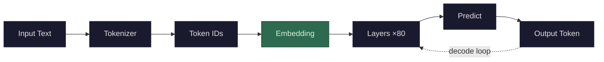

After tokenization gives you a sequence of token IDs like `[40, 3021, 5765, 18510, 540]`, the model needs to convert each ID into a vector the neural network can work with. This is the embedding step, and it's shockingly simple.

**The embedding table is just a giant lookup matrix.** If your vocabulary has 128,000 tokens and your model uses 8,192-dimensional vectors (as in Llama 3 70B), the embedding table is a matrix with 128,000 rows and 8,192 columns. Each row is one token's vector. To embed [token ID](/llms/what-happens/tokens/) 3021, you literally go to row 3,021 and grab that row. No computation, no formula — it's an array index. The entire "conversion from token to vector" is a table lookup.

**So where do the numbers in the table come from?** They're *learned during training*. When the model is first initialized, every embedding vector is random noise. During training, as the model processes trillions of tokens and adjusts its weights to get better at [next-token prediction](/llms/what-happens/embeddings/model-layers/final-vector-to-token/), the embedding vectors get adjusted too. Tokens that behave similarly in context gradually drift toward similar vectors. Tokens that behave differently drift apart.

This is the key insight: **nobody designed the embedding space.** Nobody said "dimension 47 should represent formality" or "dimension 2,000 should encode verb tense." The model discovered, through billions of [gradient updates](/llms/what-happens/embeddings/gradients/), that *this particular arrangement of 8,192 numbers* is the most useful way to represent each token for the task of predicting what comes next. The geometry of the space — which tokens are near which, what directions mean what — emerged from the data.

**What does "near each other" actually look like?** In a well-trained embedding space, you get relationships like:
- "king" and "queen" are close to each other (both royalty)
- "king" - "man" + "woman" ≈ "queen" (the famous word2vec result — directions in the space encode relationships)
- "Python" the language and "Python" the snake have *different* token contexts, so the model learns to represent them differently once context is applied (more on this when we get to attention)

**Performance profile:** Embedding lookup runs on the **GPU** and is **memory-bandwidth bound**. There's zero math — it's a gather operation, reading rows from HBM. The embedding table for Llama 3 70B is 128,000 × 8,192 × 2 bytes (FP16) ≈ **2 GB**. That fits easily in HBM and the lookup is nearly instantaneous. Embedding is never a bottleneck — it's the cheapest step in the entire pipeline.

**One subtlety: there are actually two things called "embeddings."** The static embedding table gives each token the same vector regardless of context — "bank" gets the same initial vector whether it's a river bank or a financial bank. But after passing through the model's layers, each token's vector has been transformed based on everything around it. These *contextual* representations are also called embeddings (or [hidden states](/llms/what-happens/embeddings/hidden-states/)). When people talk about "embeddings" in the context of semantic search or RAG, they usually mean the output of the full model (or a model specifically trained to produce them), not the raw lookup table.
