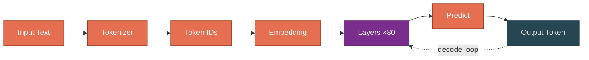

`🟠 Prefill (compute-bound)` · `🟣 Both phases` · `🟢 Decode (memory-bandwidth-bound)`

When you send a message to an LLM, inference happens in two distinct phases. Understanding these two phases is key to understanding why LLMs perform the way they do.

**Prefill** is the first phase. The model takes your entire input — every token in your prompt and conversation history — and processes it all at once through every layer. All input tokens flow through the attention and [feed-forward](/llms/what-happens/embeddings/model-layers/ffn-deep-dive/) steps in parallel. This is steps 1-3 from the root: tokenize, embed, push through all layers, produce the first output token. Prefill is **compute-bound** — the GPU is doing massive parallel matrix multiplications across all your input tokens simultaneously, and the bottleneck is how fast it can do the math.

**Decode** is the second phase. It's the token-by-token generation loop from step 4 of the root. After prefill produces the first output token, that new token gets pushed through all the layers to produce the second token, then the third, and so on until the model emits a [stop signal](/llms/what-happens/embeddings/model-layers/final-vector-to-token/stopping/). Each decode step generates exactly one token. Decode is **memory-bandwidth-bound** — for each new token, the model has to read all of its weights from GPU memory (HBM), but it's only doing a small amount of math (one token's worth). The bottleneck isn't computation, it's how fast you can load hundreds of billions of weight values from memory.

**This is why LLM responses have that characteristic pattern:** a noticeable pause at the start (prefill crunching your entire input), then tokens streaming out at a steady rate (decode generating one at a time). The pause gets longer with longer inputs. The streaming speed is roughly constant regardless of input length — it's gated by memory bandwidth, not input size.

This compute-bound vs. memory-bandwidth-bound distinction is one of the most important concepts in LLM infrastructure. It drives decisions about GPU selection, batching strategies, memory hierarchy design, and why technologies like the [KV cache](/llms/what-happens/prefill-decode/kv-cache/) (which lets decode skip redundant computation by reusing results from prefill) are so critical to serving performance.
