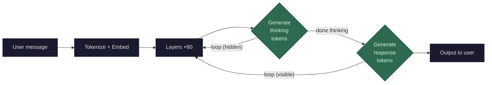

There is no separate "thinking" module. The model doesn't have an internal scratchpad or a different mode of processing. Thinking is just **more token generation** — the model produces tokens that happen to be reasoning steps before producing the tokens that are the answer.

**Chain-of-thought (CoT)** was the first version of this. Researchers discovered that if you prompt the model with "Let's think step by step" or show it examples that include intermediate reasoning, the model generates better answers because each reasoning token becomes part of the context for the next prediction. When the model writes "First, let's consider X..." those tokens go back through all 80 layers during the next [decode](/llms/what-happens/prefill-decode/) step, giving the model access to information it just worked out. Without that intermediate text, the model has to make the full reasoning leap in a single [next-token prediction](/llms/what-happens/embeddings/model-layers/final-vector-to-token/) — which is harder.

**Extended thinking** (as in Claude's thinking mode) takes this further. The model is trained to produce a dedicated thinking block — a long sequence of reasoning tokens that the user doesn't see — before generating the visible response. The mechanics are identical to normal generation: tokenize, embed, 80 layers, predict next token, loop. The only differences are:

1. **Training**: the model was specifically trained (via RLHF or similar techniques) to produce useful reasoning in a designated thinking format before answering. It learned that generating intermediate steps leads to higher-quality final answers, so the training reward signal reinforced that behavior.

2. **Token budget**: thinking models are allowed (and encouraged) to generate many more tokens — sometimes thousands of reasoning tokens before the visible response begins. More thinking tokens = more "passes" through the 80 layers = more opportunity for the model to refine its internal representation of the problem.

3. **Visibility**: the thinking tokens are generated but can be hidden from the user in the API response. They still cost compute — every thinking token goes through the full forward pass — but the user only sees the final answer.

**What this means architecturally:** thinking doesn't change any of the machinery we've covered. Same [tokenizer](/llms/what-happens/tokens/tokenization/), same [embeddings](/llms/what-happens/embeddings/), same layers, same attention, same FFN, same prediction step. The model just generates more tokens before the ones you see. The "intelligence" improvement comes from the model having more sequential token-generation steps to work through a problem — each step refines the context that subsequent steps build on.

**The implication is striking:** the model's reasoning capability is directly proportional to the number of tokens it generates. A model forced to answer in 10 tokens will be worse at complex problems than the same model allowed 1,000 tokens of thinking. The weights are identical — the only difference is how many times the decode loop runs before producing the visible answer.

**Performance profile:** Thinking runs on the **GPU** and has the same performance characteristics as any other token generation — **memory-bandwidth bound** during decode. The cost is purely proportional to the number of thinking tokens generated. If the model thinks for 2,000 tokens before a 200-token response, the total compute is ~10× what the response alone would cost. This is why thinking models are more expensive to run: not because the architecture is different, but because they generate significantly more tokens per request. The [KV cache](/llms/what-happens/prefill-decode/kv-cache/) also grows with thinking tokens — those K/V vectors must be stored and attended to just like any other tokens.
