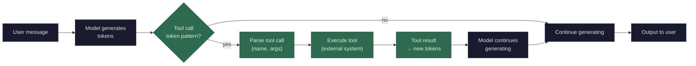

Tool calling is not a special capability baked into the model architecture. The model doesn't "run code" or "access the internet." It generates text that happens to follow a specific structured format, and external software intercepts that text, executes the action, and feeds the result back as more text.

**The mechanics:**

1. **Training**: the model is trained on examples that include tool calls — structured output like `{"tool": "calculator", "args": {"expression": "347 * 892"}}` followed by a result like `{"result": 309524}` followed by the model continuing with that information. Through the same [gradient descent](/llms/what-happens/embeddings/gradients/) process ([gradients](/llms/what-happens/embeddings/gradients/)), the model learns: when I need external information or computation, generating this structured format gets me a useful result that I can then use.

2. **Prompting**: when you use an API with tools enabled, the system prompt includes descriptions of available tools — their names, what they do, and what arguments they accept. This becomes part of the input token sequence the model attends to. The model doesn't "know" about tools innately — it sees the tool descriptions in its context and generates accordingly.

3. **Generation**: the model generates tokens one at a time (same [decode](/llms/what-happens/prefill-decode/) loop as always). At some point it starts producing tokens that form a tool call pattern — typically a JSON structure with a tool name and arguments. There is nothing mechanically different about these tokens. The model is just predicting the next most likely token, and given its training and the tool descriptions in context, the most likely next tokens happen to form a well-structured tool call.

4. **Interception**: external software (the API server, the client application, the harness) monitors the model's output and detects when a complete tool call has been generated. It **pauses generation**, extracts the tool name and arguments, and executes the tool in the real world — running a web search, querying a database, executing code, reading a file.

5. **Result injection**: the tool's result gets formatted as text, [tokenized](/llms/what-happens/tokens/tokenization/), and appended to the conversation as if it were a new message. The model's context now includes everything prior plus the tool result.

6. **Continuation**: the model resumes generating, now with the tool result in its context. It attends to the result tokens through the normal [attention mechanism](/llms/what-happens/embeddings/model-layers/attention-deep-dive/) and uses that information to formulate its response.

**What this means:** the model never "uses" a tool. It generates text that *describes* a tool call. External software does the actual work and feeds the result back. The model's only contribution is knowing *when* to call a tool, *which* tool to call, and *what arguments* to pass — all of which it learned during training by seeing thousands of examples of successful tool use patterns.

**Multi-step tool use** works by repeating this loop. The model generates a tool call, gets a result, generates another tool call based on that result, gets another result, and so on — each step adding to the context. The model is doing the same thing it always does (predicting the next token given everything so far), but the "everything so far" now includes tool results that give it access to real-world information.

**Performance profile:** Tool calls don't change the model's compute characteristics — generating tool call tokens is the same decode loop (**memory-bandwidth bound**). The overhead is in the **tool execution latency**: the model pauses while the external system runs the tool. A web search might take 500ms-2s. A database query might take 50ms. During this time the GPU is idle (or serving other requests). The round-trip — generate call, pause for execution, inject result, resume generation — adds latency proportional to how many tools are called and how long each takes. The context also grows with each tool result, increasing [KV cache](/llms/what-happens/prefill-decode/kv-cache/) usage and subsequent attention computation.
