```mermaid
graph LR
    A[Input Text] --> B[Tokenizer] --> C[Token IDs] --> D["Embedding<br/>→ embedding"]:::s1 --> E["Layer 1"]:::s2 --> F["Layer 2...79"]:::s2 --> G["Layer 80"]:::s2 --> H["Final hidden<br/>state"]:::s3 --> I[Vocab Proj] --> J[Output]
    classDef s1 fill:#264653,stroke:#1a3340,color:#e0e0e0
    classDef s2 fill:#2d6a4f,stroke:#1b4332,color:#d8f3dc
    classDef s3 fill:#e76f51,stroke:#9c3a1a,color:#fff
    classDef default fill:#1a1a2e,stroke:#16213e,color:#e0e0e0

    click A "/llms/what-happens/"
    click B "/llms/what-happens/tokens/"
    click C "/llms/what-happens/tokens/"
    click D "/llms/what-happens/embeddings/"
    click I "/llms/what-happens/embeddings/model-layers/final-vector-to-token/"
    click J "/llms/what-happens/embeddings/model-layers/final-vector-to-token/"
```

`🔵 Embedding (pre-context)` · `🟢 Hidden states (layers 1-80)` · `🟠 Final hidden state (→ prediction)`

Hidden states are simply what the token vectors are called once they're inside the model. Before layer 1, they're called [embeddings](/llms/what-happens/embeddings/). After passing through one or more layers, they're called hidden states. After the final layer, they're sometimes called the model's "output representations."

It's the same data type — an 8,192-dimensional vector per token — at every stage. The name just tells you *where* in the pipeline you're looking:

- **Embedding**: the raw lookup table vector, no context applied yet
- **Hidden state at layer N**: the vector after N layers of attention + [feed-forward](/llms/what-happens/embeddings/model-layers/ffn-deep-dive/) transformations
- **Final hidden state**: the vector after the last layer, right before it gets projected to predict the next token

"Hidden" because you don't see them — they're internal to the model. The only thing that's visible to you is the final output (the predicted tokens). But researchers can extract hidden states at any layer to study what the model is representing internally. This is the basis of *mechanistic interpretability* — trying to understand what's encoded in these intermediate vectors and how the model "thinks."

The progression from embedding → layer 1 hidden state → ... → layer 80 hidden state is the entire computation of the model. Your input goes in as simple token-level vectors and comes out as richly contextual representations that encode enough information to predict the next token.
