```mermaid
graph LR
    A[Input Text] --> B[Tokenizer] --> C[Token IDs] --> D[Embedding] --> E[Q,K,V Proj] --> F[Attn Scores]
    E -->|"K,V cached"| KV["KV Cache<br/>(HBM)"]:::hl
    KV -->|"read during decode"| F:::hl
    F --> G[Weighted Sum] --> H[Residual] --> I[FFN] --> J[Residual] --> K["→ ×80"] --> L[Vocab Proj] --> M[Output]
    classDef hl fill:#2d6a4f,stroke:#1b4332,color:#d8f3dc
    classDef default fill:#1a1a2e,stroke:#16213e,color:#e0e0e0

    click A "/llms/what-happens/"
    click B "/llms/what-happens/tokens/"
    click C "/llms/what-happens/tokens/"
    click D "/llms/what-happens/embeddings/"
    click E "/llms/what-happens/embeddings/model-layers/attention-deep-dive/"
    click F "/llms/what-happens/embeddings/model-layers/attention-deep-dive/"
    click G "/llms/what-happens/embeddings/model-layers/attention-deep-dive/"
    click H "/llms/what-happens/embeddings/model-layers/"
    click I "/llms/what-happens/embeddings/model-layers/ffn-deep-dive/"
    click J "/llms/what-happens/embeddings/model-layers/"
    click L "/llms/what-happens/embeddings/model-layers/final-vector-to-token/"
    click M "/llms/what-happens/embeddings/model-layers/final-vector-to-token/"
```

During prefill, every token at every layer produces three vectors: a **query** (Q), a **key** (K), and a **value** (V). The query is ephemeral — it's used once to compute attention scores against all the keys and then discarded. No future token will ever need it, because each new token brings its own fresh query. But the keys and values are different: when token 501 is generated during decode, it needs the K vectors from all 500 previous tokens (to dot-product its new Q against) and the V vectors (to compute the weighted sum). Recomputing them from scratch every decode step would mean re-running the K and V projection matrix multiplications for all previous tokens — enormously wasteful. So only K and V get cached in GPU memory. This is the **KV cache** (not the QKV cache — Q is never stored).

**Why cache every layer's K/V, not just the final layer's?** Because each layer does its own independent attention with its own W_K and W_V weight matrices. Layer 40's keys are completely different numbers than layer 1's keys for the same token — they're produced by different weight matrices applied to different intermediate hidden states. During decode, when the new token passes through layer 40, its query needs layer 40's cached keys to compute attention scores. If you threw them away, you'd have to recompute them — which means re-running every previous token through layers 1-39 to get the hidden states at layer 40, then multiplying by layer 40's W_K. That's essentially re-running prefill from scratch on every decode step, which is exactly the cost the KV cache exists to avoid. Once a response is complete and sent, the entire KV cache for that request is freed — it's only needed during generation.

The KV cache grows as: `T × L × 2 × D × bytes_per_value`
- `T` = sequence length (number of tokens)
- `L` = number of layers (each layer has its own K and V)
- `2` = one key + one value per token per layer
- `D` = dimension size (or more precisely, the head dimension × number of KV heads)
- `bytes_per_value` = typically 2 bytes at FP16

**Concrete example on a B200:** Take a model with 80 layers, 8,192 dimensions, at FP16. For a 100K token context:

100,000 × 80 × 2 × 8,192 × 2 bytes = **~250 GB**

That's just the cache — not the model weights, not the activations (the transient intermediate values computed and discarded at each step during inference — the expanded vector before [SiLU](/llms/what-happens/embeddings/layer-transforms/), the [attention scores](/llms/what-happens/embeddings/model-layers/attention-deep-dive/) before softmax, etc.), just the stored keys and values. A B200 has 192 GB of HBM3e. So this single request's KV cache already exceeds the memory of one GPU. This is why long context is fundamentally a **memory capacity problem** before it's a compute problem. You can do tricks to reduce the compute ([sparse attention](/llms/what-happens/prefill-decode/kv-cache/sparse-attention/), approximations), but you still need somewhere to *store* all those K and V vectors if the model needs to attend to them.

This is exactly where KV cache management becomes a critical infrastructure concern:
- **KV cache [quantization](/llms/what-happens/prefill-decode/kv-cache/quantization/)** — storing K/V in lower precision (INT8, INT4) to cut memory by 2-4x at some accuracy cost
- **[Paged attention](/llms/what-happens/prefill-decode/kv-cache/paged-attention/)** (vLLM) — managing KV cache like virtual memory pages so you don't waste GPU memory on fragmentation
- **[KV cache offloading](/llms/what-happens/prefill-decode/kv-cache/kv-cache-offloading/)** — spilling the cache to CPU memory or fast storage (NVMe, purpose-built KV cache storage tiers) when it doesn't fit in HBM, and fetching it back as needed
- **Multi-query attention / [Grouped-query attention](/llms/what-happens/prefill-decode/kv-cache/mqa-gqa/)** — architectural changes that share K/V heads across multiple query heads, reducing cache size at the model design level

The tension is always: longer context = more expressive model that can reference more information, but the memory cost scales linearly with sequence length while the attention compute scales quadratically. Every token you add to the context makes both problems worse.

**Performance profile:** The KV cache is purely a **memory capacity** and **memory bandwidth** concern — there is zero compute involved in maintaining it. Writing to the cache during [prefill](/llms/what-happens/prefill-decode/) (storing each token's K and V after projection) is cheap — it's just a memory write. Reading from the cache during decode is where the cost lives: every decode step reads the *entire* cache to compute attention scores. For Llama 3 70B at T=32K, that's ~84 GB of KV cache read from HBM per decode step, on top of ~140 GB of model weights — so each generated token requires reading **~224 GB** from HBM. On a B200 with ~8 TB/s bandwidth, that's ~28ms per token, giving a theoretical ceiling of ~36 tokens/second *per request* (before batching). The KV cache is the reason decode throughput degrades with longer contexts: at T=4K the cache read is ~11 GB (fast), at T=100K it's ~262 GB (the cache alone exceeds B200 HBM capacity). This is the core tension that drives every optimization in this space — the cache has to be *somewhere* the GPU can read it fast enough.
