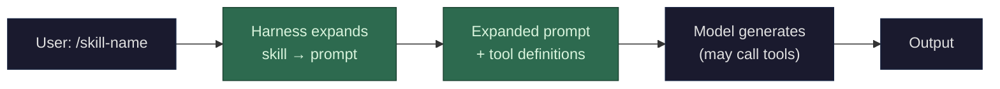

A skill is not something the model does — it's something the **harness** (the software wrapping the model) does before and after the model runs.

**What a skill actually is:** a pre-packaged bundle of instructions, tool definitions, and sometimes multi-step workflows, triggered by a user shortcut (like `/commit` or `/review-pr`). When you invoke a skill:

1. **The harness intercepts it.** The `/skill-name` never reaches the model as literal text. The harness software catches it.

2. **The harness expands it.** The skill definition includes a detailed prompt (instructions for what the model should do), possibly specific tool definitions (which tools are available for this skill), and constraints (output format, what files to read, etc.). This expanded prompt gets injected into the model's context.

3. **The model runs normally.** From the model's perspective, it just received a detailed prompt with tools available. It generates tokens, potentially makes tool calls (see [tool calls](/llms/what-happens/tool-calls/)), and produces output — same mechanics as any other interaction.

4. **The harness may post-process.** Some skills include follow-up steps — running the model's output through a linter, creating a git commit, opening a PR.

**The key insight:** skills are a *software pattern*, not a model capability. The model has no concept of "skills" — it sees prompts and tools. The skill system lives entirely in the application layer, making it easy to create new skills without retraining the model. It's the same principle as tool calls but at a higher level of abstraction: tool calls give the model access to individual actions; skills orchestrate those actions into coherent workflows.

**How this differs from tool calls:** Tool calls are *generated by the model* — the model decides when and how to call a tool. Skills are *initiated by the user or harness* — they set up the context and tools, then let the model execute within that frame. A skill might result in the model making multiple tool calls, but the skill itself is the scaffolding that makes those tool calls coherent.

**Performance profile:** No additional model-level cost beyond what the expanded prompt and any tool calls introduce. The skill expansion itself is **CPU-only** and instantaneous (it's string templating). The cost is in the expanded prompt length (more input tokens = more [prefill](/llms/what-happens/prefill-decode/) compute) and any tool calls the model makes during execution (latency from tool execution, growing context from tool results).
