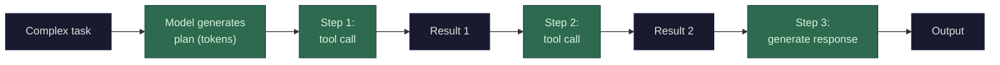

Planning is an extension of thinking ([thinking](/llms/what-happens/thinking/)) combined with tool use ([tool calls](/llms/what-happens/tool-calls/)). The model doesn't have a planner module — it generates a plan as text, then executes it step by step through the normal token generation and tool call loop.

**How a multi-step task unfolds:**

1. **The model receives a complex request** — e.g., "refactor the authentication module to use JWT tokens." This becomes tokens in the context.

2. **The model generates a plan** — either in visible text or in a thinking block: "First, I need to read the current auth module. Then identify all session-based auth calls. Then write the JWT implementation. Then update the tests." These are just generated tokens — the model is doing [next-token prediction](/llms/what-happens/embeddings/model-layers/final-vector-to-token/), and the most likely tokens given a complex task happen to look like a plan (because the training data included many examples of step-by-step problem solving).

3. **The model executes step 1** — generates a tool call (e.g., read a file). The harness executes it and injects the result. The context now includes the plan + the file contents.

4. **The model executes step 2** — with the plan and previous results in context, it generates the next tool call. Each step builds on the accumulated context from previous steps.

5. **Continue until done** — the model keeps generating tool calls and incorporating results until it determines (via the same statistical prediction) that it has enough information to produce the final output.

**What makes this work (and what limits it):**

The model's "plan" isn't stored in a data structure or tracked by a planner. It exists only as tokens in the context window. The model "remembers" the plan because those tokens are still there, being attended to at every decode step. This means:

- **Context is the working memory.** Every tool result, every intermediate thought, every step of the plan lives in the context as tokens. The model can reference any of it through attention. But it all competes for space in the context window and [KV cache](/llms/what-happens/prefill-decode/kv-cache/).

- **Plans can drift.** Because the model regenerates its understanding at every token prediction, it can lose track of the plan if the context gets long and noisy. A tool result that's very long (e.g., a huge file) can push the plan tokens far back in the context, where they may receive less attention. This is why long multi-step tasks sometimes go off track.

- **No backtracking.** The model generates left to right. If step 3 reveals that the plan from step 1 was wrong, the model can *generate text acknowledging this* and adjust going forward, but it can't go back and un-generate previous tokens. The adjustment is forward-only — new tokens that override or correct earlier reasoning.

- **The harness can help.** Sophisticated harnesses (like agentic frameworks) can structure the execution: maintain an explicit task list, re-inject the plan at each step, detect when the model has gone off track, and prompt it to reassess. This is software scaffolding around the model's generation loop — the model itself is still just predicting the next token.

**Performance profile:** Multi-step execution multiplies all costs. Each step adds tokens to the context (plan text + tool calls + tool results), so [prefill](/llms/what-happens/prefill-decode/) and KV cache costs grow with each step. A 10-step plan that accumulates 20K tokens of context costs roughly 5× what a simple 4K-token interaction costs for prefill, plus the tool execution latency at each step. The model itself is doing the same operation (decode, memory-bandwidth bound) — it's just doing it many more times with a larger and larger context. This is why complex agentic tasks are expensive: not because the model works harder per token, but because there are far more tokens and far more round-trips.
