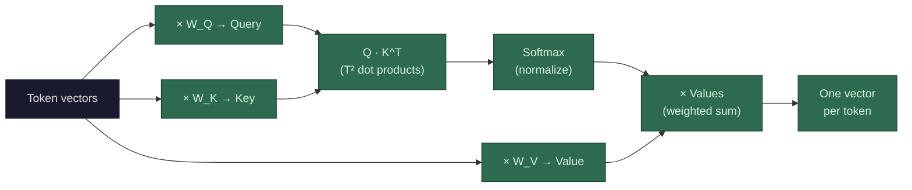

In practice, the model doesn't run attention once per layer — it runs it **multiple times in parallel** (typically 32-128 times), each with its own independent set of W_Q, W_K, W_V weight matrices. These parallel instances are called **attention heads**. Because each head has independent weights that were adjusted separately during training (via gradient descent — see [gradients](/llms/what-happens/embeddings/gradients/)), each head's Q and K projections ended up producing high dot products for *different* types of token pairs. No one designed this specialization — it emerged because the gradients pushed each head toward whatever relationship patterns most helped reduce prediction loss. If head 12 already captures subject-verb relationships well, there's no gradient signal pushing other heads to duplicate that work, so they get pushed toward other uncovered patterns instead. The result: heads end up specializing — one for subject-verb connections, another for positional proximity, another for coreference. The outputs of all heads are concatenated and projected back to the original dimension. This is how a single attention layer captures many different types of relationships simultaneously. (See [multi-head attention](/llms/what-happens/embeddings/model-layers/attention-deep-dive/multi-head-attention/) for the full math and cost analysis.)

Now let's trace what happens inside a single head with a concrete example. Say our input is "The cat sat on the mat" — 6 tokens. Each token has an 8,192-dimensional embedding vector. We're inside one layer, at the attention step, looking at one head.

**Step 1: Create Q, K, V vectors.** Each token's vector gets multiplied by this head's three learned weight matrices — `W_Q`, `W_K`, `W_V` — to produce three new vectors per token:

- **Query (Q)**: "What am I looking for?" — represents what information this token *needs*
- **Key (K)**: "What do I have to offer?" — represents what information this token *contains*
- **Value (V)**: "Here's my actual information" — the content that gets passed along if another token attends to me

Think of it like a conference. Your **query** is "I need someone who knows about GPU memory hierarchies." Every other person's **key** is their name badge — "GPU architect," "marketing lead," "storage engineer." You scan the badges (Q · K dot products) to figure out who's relevant. But the badge isn't the conversation — the **value** is what they actually tell you when you walk over and talk. The key helps you *find* them; the value is what you *get* from the interaction. A token's key and value don't have to encode the same thing — and they don't. The model might learn that a token's key should advertise "I'm a subject noun" (so verbs can find it), while its value carries the actual semantic content like "cat, animate, singular" that gets blended into the verb's representation.

These projections are critical. The raw embedding for "sat" doesn't inherently know to look for a subject. But `W_Q` is learned during training to *produce* a query vector from "sat" that naturally has a high dot product with subject-like key vectors. The weight matrices learn what kinds of questions to ask and what kinds of answers to advertise.

**Step 2: Compute attention scores.** Every token's query gets dot-producted against every token's key:

```
         Key_The  Key_cat  Key_sat  Key_on  Key_the  Key_mat
Q_The    [  1.2    0.3      0.1     -0.2     1.1      0.0  ]
Q_cat    [  0.8    0.5      0.4      0.1     0.2      0.1  ]
Q_sat    [  0.3    4.7      0.2      0.6     0.1      3.9  ]
Q_on     [  0.1    0.2      0.5      0.3     0.1      2.1  ]
Q_the    [  1.0    0.2      0.1     -0.1     1.3      0.4  ]
Q_mat    [  0.2    0.1      0.3      1.8     0.4      0.5  ]
```

Look at the "sat" row: high scores for "cat" (4.7) and "mat" (3.9). The model learned that "sat" should attend heavily to its subject and its location. These scores are **not hand-programmed** — they emerge from the learned Q and K projections.

**Step 3: Normalize with softmax.** The raw scores get passed through softmax, which converts each row into probabilities that sum to 1. The "sat" row might become something like `[0.01, 0.52, 0.01, 0.02, 0.01, 0.43]` — roughly 52% attention on "cat," 43% on "mat," and scraps for everything else.

**Step 4: Weighted sum of value vectors.** Now "sat"'s new representation is computed as: `0.01 × V_The + 0.52 × V_cat + 0.01 × V_sat + 0.02 × V_on + 0.01 × V_the + 0.43 × V_mat`. Each V is an 8,192-dimensional vector. Multiplying a vector by a scalar and adding vectors together gives you... one 8,192-dimensional vector. The T² cost of attention is in *computing the scores* (all those pairwise [dot products](/llms/what-happens/vectors/dot-product/)), not in the output — the weighted sum collapses everything back down to **one vector per token, same dimensionality as the input**. This is critical: the shape never changes. Every layer takes in one vector per token and outputs one vector per token, always the same dimension. That's what lets you stack 80 identical layers. The result is a vector that's mostly a blend of "cat"'s and "mat"'s value information — "sat" now *contains* information about its subject and location, baked into its representation.

**Performance profile:** Attention's cost splits across its steps. **Steps 1 (QKV projections)** are matrix multiplications — compute-bound during [prefill](/llms/what-happens/prefill-decode/), bandwidth-bound during decode. The [weight matrices](/llms/what-happens/embeddings/weights/) for Q, K, V, and output projection total 4 × d_model² = 4 × 8,192² ≈ **268 million weights per layer** (537 MB at FP16). **Step 2 (score computation)** is the T² operation — compute-bound during prefill since all T² dot products run as a batched matmul. During decode, this step computes just T dot products (one new query against all cached keys), making it bandwidth-bound (reading the [KV cache](/llms/what-happens/prefill-decode/kv-cache/)). **Step 3 (softmax)** is element-wise and trivially cheap. **Step 4 (weighted sum)** is another T² operation with the same prefill/decode split. The dominant cost during prefill is the T² attention score computation at long sequence lengths. During decode, the dominant cost is loading the QKV projection weights and the KV cache from HBM for every single generated token.
