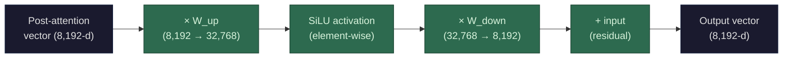

After attention has mixed information between tokens, each token's vector passes through the **feed-forward network (FFN)** — and this is the solo step. No cross-token interaction whatsoever. Every token passes independently through the exact same weights. If you have 500 tokens, the FFN runs 500 times in parallel, each one completely unaware of the others.

The FFN is two matrix multiplications with a nonlinear activation sandwiched between them:

**Step 1: Expand.** Multiply the token's vector by a weight matrix `W_up` that projects it from `d_model` (8,192) into a much larger intermediate space — typically 4× larger, so 32,768 dimensions. This is called the **hidden dimension** or `d_ff`.

`[8,192-d vector] × [8,192 × 32,768 matrix] → [32,768-d vector]`

**Step 2: Nonlinear activation.** Apply an activation function element-wise — each of the 32,768 numbers gets transformed independently. Modern LLMs typically use **SiLU** (also called Swish):

`SiLU(x) = x × sigmoid(x) = x × (1 / (1 + e^(-x)))`

This leaves large positive values mostly untouched, pushes values near zero toward zero, and dampens negative values (but doesn't fully kill them like the older ReLU function).

**Why is this step critical?** Without the nonlinearity, the two matrix multiplications collapse into one — `W_up` followed by `W_down` is mathematically equivalent to a single matrix `W_up × W_down`. Stacking layers would be pointless because the whole model would reduce to one linear transformation. The activation function breaks this equivalence. It means expand → activate → compress can represent things that no single matrix multiplication can. This is what gives depth its power — each layer adds genuinely new representational capacity because of the nonlinearity in between.

**Step 3: Compress.** Multiply the activated 32,768-d vector by a second weight matrix `W_down` that projects it back to `d_model` (8,192).

`[32,768-d vector] × [32,768 × 8,192 matrix] → [8,192-d vector]`

**Step 4: Residual add.** Add this result back to the vector that entered the FFN (the post-attention vector). Same residual pattern as attention — the FFN computes a *modification*, not a replacement.

**Full path:** 8,192 → expand to 32,768 → SiLU activation → compress to 8,192 → add to input.

**Why expand and then compress?** The expansion into a higher-dimensional space gives the model more room to do the nonlinear transformation. Some patterns in the data are only separable in a higher-dimensional space. The expansion creates that space, the activation carves out nonlinear decision boundaries, and the compression maps the result back to the working dimension. The wider the intermediate space, the more capacity — but the more parameters and compute.

**The weight cost is significant:**
- `W_up`: 8,192 × 32,768 = 268 million weights per layer
- `W_down`: 32,768 × 8,192 = 268 million weights per layer
- Total: ~537 million weights per layer, just for FFN

Across 80 layers: **~43 billion parameters in FFN weights alone.** In most large models, the FFN accounts for roughly two-thirds of the total parameter count. Attention gets the headlines, but FFN is where the bulk of the model's weights live.

(Note: modern architectures like Llama use a "gated" FFN variant called **SwiGLU**, which adds a third weight matrix — a "gate" projection that also expands to `d_ff`, gets multiplied element-wise with the activated `W_up` output before compression. This adds ~50% more FFN parameters but improves model quality. The conceptual flow is the same.)

**Performance profile:** The FFN is **compute-bound** during [prefill](/llms/what-happens/prefill-decode/) and **memory-bandwidth bound** during decode — same pattern as attention, but for different reasons. During prefill, every token passes through the W_up and W_down matmuls in parallel — that's T tokens × two large matrix multiplications, lots of FLOPs, and the GPU stays busy. During decode, you're pushing one token through W_up (loading 537 MB from HBM) and W_down (loading another 537 MB), but doing minimal math — the [arithmetic intensity](/llms/what-happens/embeddings/layer-transforms/dimension-tradeoffs/) drops dramatically. The [activation function](/llms/what-happens/embeddings/layer-transforms/) (SiLU) and residual add are bandwidth-bound but trivially cheap in either phase. Per layer, the FFN's compute cost roughly equals the attention projections' cost (both are d_model² matmuls), but the FFN has no T² component — it scales linearly with sequence length. This makes the FFN relatively cheaper than attention at long context lengths but still dominant at short context lengths where projections outweigh the T² attention term.
