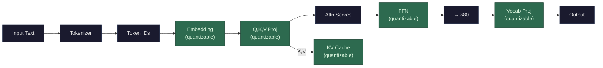

*Highlighted: everything that can be quantized to reduce memory*

Quantization means storing numbers with fewer bits. Every weight, every cached K/V vector, every activation is a number that takes up space in memory. The question is: how precisely do you need to store it?

**Two fundamentally different number formats:**

**Floating point (FP)** stores numbers as mantissa × 2^exponent — like scientific notation. FP16 has 1 sign bit, 5 exponent bits, and 10 mantissa bits. This gives it a wide dynamic range (can represent very large and very small numbers) but with limited precision at any given scale. BF16 trades mantissa for exponent range (1 sign, 8 exponent, 7 mantissa) — less precise but covers a wider range, which turns out to matter more for neural network training.

**Integer (INT)** stores numbers as fixed whole values in a range, evenly spaced. INT8 = 256 values (-128 to 127). INT4 = 16 values (-8 to 7). No exponent, no floating point — just uniform steps across a range.

**Why the format changes as you go lower:**

At 16 bits, you have enough bits to afford the floating-point overhead (sign + exponent + mantissa) and still get useful precision. FP16 gives you ~65,000 distinct values with a wide dynamic range.

At 8 bits, you only have 256 total values. You *could* use FP8 — and modern GPUs like the B200 actually support it (1 sign, 4 exponent, 3 mantissa). FP8 is increasingly popular because it preserves the dynamic range advantage of floating point. But **INT8** has been the standard for quantization because: integer multiply-accumulate is cheaper and faster in hardware, uniform spacing works well enough with only 256 values, and INT8 tooling is mature (years of calibration methods and per-channel scaling techniques). In practice, both FP8 and INT8 are used at this precision level.

At 4 bits, it's almost always INT4 or specialized formats like NF4 ("normal float 4," used in QLoRA, which spaces its 16 values according to a normal distribution rather than uniformly — putting more precision near zero where most weights live). FP4 exists conceptually but 4 bits is too few to meaningfully split between exponent and mantissa.

**The precision ladder:**

| Format | Bits | Type | Memory for 70B params | Typical use |
|--------|------|------|----------------------|-------------|
| FP32 | 32 | Floating point | 280 GB | Training — gradient accumulation |
| FP16 / BF16 | 16 | Floating point | 140 GB | Inference standard |
| FP8 | 8 | Floating point | 70 GB | Inference on new GPUs (B200: ~2× FP16 throughput) |
| INT8 | 8 | Integer | 70 GB | Inference — established, widely supported |
| INT4 / NF4 | 4 | Integer / special | 35 GB | Aggressive quantization, some quality loss |

The boundary between FP and INT is blurring as GPU hardware catches up. FP8 support on the B200 means you get the memory savings of 8-bit without switching to integer representation — best of both worlds. But INT8 remains the default for post-training quantization because of tooling maturity.

**Why it works despite the precision loss:** Neural network weights are surprisingly tolerant of imprecision. Most weights are small numbers clustered near zero, and the model's behavior depends on the overall pattern of millions of weights, not any individual value. Rounding each weight slightly doesn't change the pattern much. Research has shown that 8-bit quantization produces nearly identical outputs to FP16 for most models. 4-bit quantization introduces measurable quality degradation but is still usable for many applications.

**How quantization works in practice (for INT quantization):**

1. **Calibration**: Run a small set of representative inputs through the FP16 model to observe the actual range of values in each weight matrix and activation.
2. **Scale and zero-point**: For each tensor (weight matrix or cache), compute a scale factor that maps the FP16 range to the INT range. For example, if weights range from -0.5 to 0.5, and you're mapping to INT8 (-128 to 127), the scale is 0.5/127 ≈ 0.004.
3. **Quantize**: `quantized_value = round(original_value / scale)`
4. **Dequantize at compute time**: When the GPU needs to do a matrix multiplication, it converts back: `approximate_value = quantized_value × scale`. This happens on-the-fly during computation.

FP8 quantization is simpler — it's a direct cast from FP16 to FP8 with rounding, no scale factor needed (the exponent handles dynamic range natively).

**What gets quantized:**
- **Weight quantization**: the model's [weight matrices](/llms/what-happens/embeddings/weights/) are stored in INT8/INT4/FP8. Most common, biggest memory savings, applied post-training.
- **[KV cache](/llms/what-happens/prefill-decode/kv-cache/) quantization**: the cached K and V vectors are stored in INT8 or FP8 instead of FP16, cutting KV cache memory by 2×. At T=100K this is the difference between 262 GB and 131 GB — potentially making it fit in HBM.
- **Activation quantization**: the intermediate computation values are quantized. Harder to do well because activations have more dynamic range than weights. Usually requires quantization-aware training.

**Performance profile:** Quantization primarily reduces **memory** — both capacity (more fits in HBM) and bandwidth (fewer bytes to load per matrix). On a B200, loading 70 GB (INT8 or FP8) instead of 140 GB (FP16) of weights per [decode](/llms/what-happens/prefill-decode/) step roughly **doubles decode throughput** because you're reading half the data from HBM. Modern GPUs also have dedicated lower-precision compute units that execute faster than FP16 for matrix math — B200's FP8 tensor core throughput is roughly 2× its FP16 throughput, and INT8 is similar. The trade-off is always quality: the lower the precision, the more the model's outputs deviate from the FP16 baseline. FP8 tends to preserve quality better than INT8 at the same bit-width because it retains dynamic range, but INT8 with good calibration comes close.
