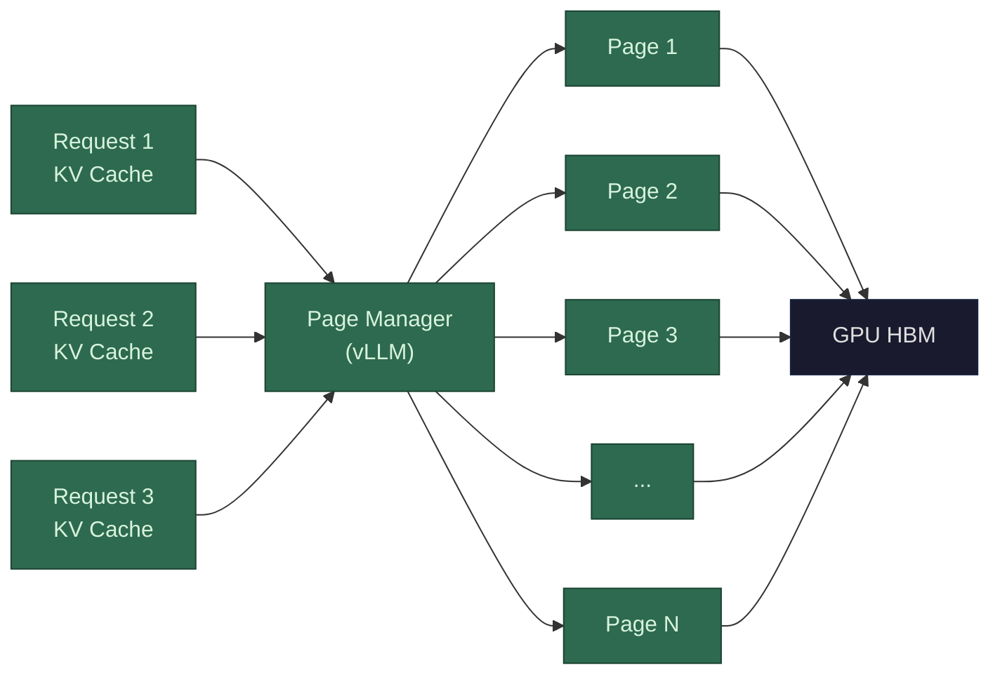

The problem paged attention solves isn't the size of the [KV cache](/llms/what-happens/prefill-decode/kv-cache/) per se — it's **fragmentation** and **waste** when serving many concurrent requests.

Without paged attention, each request gets a contiguous block of GPU memory pre-allocated for its KV cache based on the *maximum possible* sequence length. If the system supports up to 4,096 tokens, every request gets 4,096 tokens worth of KV cache allocated upfront — even if the actual conversation only ends up using 200 tokens. The unused memory is wasted, and because it's contiguous, you can't give the leftover to another request.

This is exactly the same problem operating systems solved decades ago with virtual memory. The solution is the same too:

**How paged attention works (vLLM):**

1. **Divide KV cache into fixed-size pages** (blocks), typically 16-256 tokens per page.
2. **Allocate pages on demand.** When a request starts, it gets one page. When that page fills up (16 tokens of K/V stored), allocate another page. Pages don't have to be contiguous in physical GPU memory.
3. **Use a page table** to map each request's logical token positions to physical page locations, just like an OS maps virtual addresses to physical memory.
4. **Reclaim pages** when a request finishes. Pages go back to the free pool immediately, no fragmentation.

**Why this matters at scale:** A serving system handling 100 concurrent requests with max length 4,096 would naively pre-allocate 100 × 4,096 tokens of KV cache. With paged attention, it only allocates what's actually in use — if the average conversation is 500 tokens, you're using ~12% of the naive allocation. That means you can serve **~8× more concurrent requests** on the same GPU, or support longer contexts without running out of memory.

**Additional optimization — shared prefixes:** Many requests share the same system prompt (e.g., "You are a helpful assistant..."). With paged attention, the KV cache pages for that shared prefix can be stored once and referenced by multiple requests via copy-on-write — the same technique operating systems use for shared memory between processes. This can save enormous amounts of memory in production serving.

**Performance profile:** Paged attention runs on the **GPU** and is primarily a **memory efficiency** optimization rather than a compute or bandwidth optimization. The actual attention computation is unchanged — same FLOPs, same HBM reads. The win is **throughput through better utilization**: by wasting less memory on fragmentation and over-allocation, you can batch more requests simultaneously. More concurrent requests means the GPU's compute units stay busier (better utilization) and the cost of reading model weights from HBM is amortized across more requests. vLLM reports **2-4× throughput improvements** over naive serving, almost entirely from this memory management improvement.
