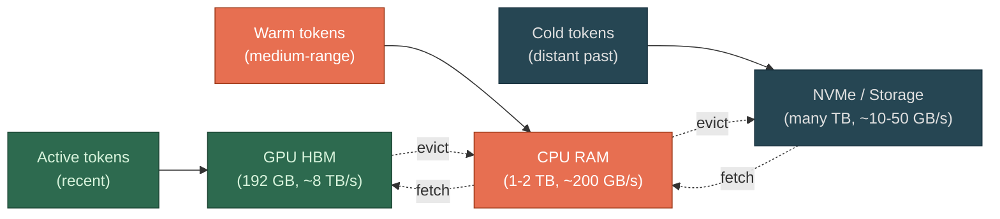

`🟢 HBM (fast, small)` · `🟠 CPU RAM (medium)` · `🔵 Storage (slow, large)`

When the [KV cache](/llms/what-happens/prefill-decode/kv-cache/) exceeds GPU HBM capacity, you have two choices: refuse the request, or move some of the cache to slower memory. Offloading chooses the second option — it creates a **memory hierarchy** for the KV cache, analogous to the CPU cache → RAM → disk hierarchy in traditional computing.

**The tiers:**

| Tier | Medium | Capacity | Bandwidth | Latency |
|------|--------|----------|-----------|---------|
| Hot | GPU HBM | 192 GB (B200) | ~8 TB/s | ~ns |
| Warm | CPU DRAM | 1-2 TB typical | ~200 GB/s | ~100ns |
| Cold | NVMe SSD | Many TB | ~10-50 GB/s | ~10-100μs |

**How offloading works:** The insight is that during decode, the new token probably doesn't attend equally to all previous tokens. [Attention scores](/llms/what-happens/embeddings/model-layers/attention-deep-dive/) typically concentrate on recent tokens and a handful of distant "anchor" tokens, with most of the middle getting near-zero attention. So you keep the most likely-to-be-attended K/V in HBM and evict the rest to CPU RAM or NVMe.

When a new token's attention scores indicate it needs an evicted K/V pair, that pair gets fetched back into HBM. This is a **cache miss** — it stalls the computation while waiting for the data to arrive from a slower tier.

**The performance trade-off is stark:**
- HBM read for a cache hit: microseconds
- CPU RAM fetch for a cache miss: ~10-100× slower
- NVMe fetch: ~1,000-10,000× slower than HBM

A single NVMe fetch is small in absolute time (microseconds), but attention may need many K/V pairs per step, and these stalls add up. The quality of the eviction policy — predicting which K/V pairs will be needed — determines whether offloading is viable or cripplingly slow.

**Eviction strategies:**
- **LRU (least recently used)**: evict tokens that haven't been attended to recently. Simple, but attention patterns aren't always predictable from recency.
- **Attention-score based**: track cumulative attention received by each token position. Tokens that consistently get low attention scores are evicted first. More accurate but requires tracking overhead.
- **Sliding window + landmarks**: keep a local window in HBM, plus the first few tokens and any tokens flagged as high-attention during [prefill](/llms/what-happens/prefill-decode/). Evict everything else. This maps well to observed attention patterns.

**Performance profile:** Offloading is fundamentally about **trading latency for capacity**. With everything in HBM, decode is ~28ms/token (bandwidth-bound). With a 50% hit rate on CPU RAM offloading, you might see ~40-60ms/token — slower, but the alternative was not being able to serve the request at all. The economics only make sense at long contexts where the KV cache exceeds HBM — for short contexts that fit in HBM, offloading adds overhead for no benefit. This is also where purpose-built KV cache storage tiers become relevant: storage that sits between NVMe and HBM in the bandwidth/latency hierarchy, optimized for the specific access patterns of KV cache reads.
