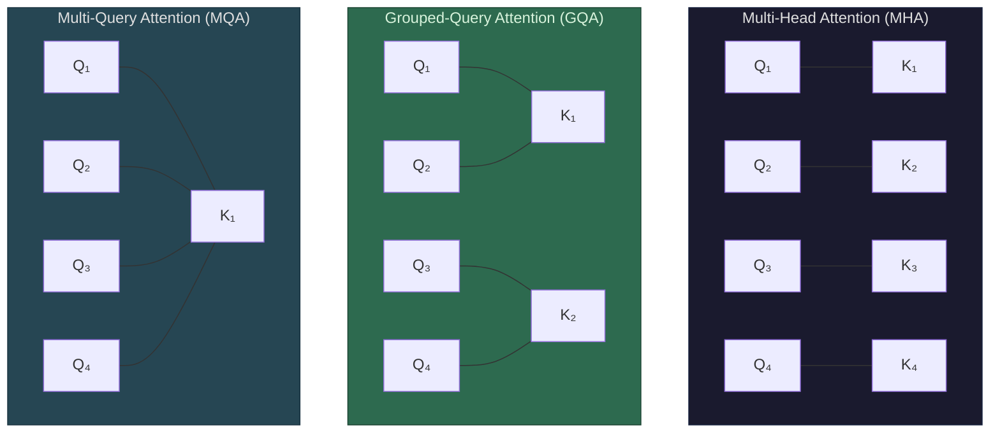

*MHA: every query head has its own K/V. GQA: groups share K/V. MQA: all queries share one K/V.*

The problem: in standard Multi-Head Attention (MHA), each of the 64 heads has its own K and V projections, so the KV cache stores 64 sets of K and V per layer. Most of the KV cache cost comes from this multiplier.

**Multi-Query Attention (MQA)** — the extreme: all 64 query heads share a single K and a single V. Each head still has its own Q (so each head still produces different attention patterns), but they all look at the same keys and values. KV cache shrinks by **64×**.

This was proposed by Noam Shazeer (2019) and the math is simple:
- MHA KV cache: `T × L × 2 × 64 × d_head × 2 bytes`
- MQA KV cache: `T × L × 2 × 1 × d_head × 2 bytes`

For Llama 3 70B at T=100K: MHA = 262 GB → MQA = 4.1 GB. Enormous savings.

**The catch:** quality drops. With one shared K/V, all 64 heads are forced to attend to the same information — they can't specialize the way they do in MHA. The model loses representational power. In practice, MQA models need to be trained from scratch with this architecture — you can't just drop the extra K/V heads from a trained MHA model.

**Grouped-Query Attention (GQA)** — the compromise: instead of 64 independent KV heads (MHA) or 1 shared KV head (MQA), you use a small number of KV groups. Llama 3 70B uses **8 KV heads** shared across 64 query heads — every 8 query heads share one K/V pair.

| Architecture | Query heads | KV heads | KV cache at T=100K | Quality impact |
|-------------|------------|----------|-------------------|---------------|
| MHA | 64 | 64 | 262 GB | Baseline |
| GQA (8 groups) | 64 | 8 | 32.8 GB | Minimal |
| MQA | 64 | 1 | 4.1 GB | Measurable |

GQA with 8 KV heads gives an **8× reduction** in [KV cache](/llms/what-happens/prefill-decode/kv-cache/) size with negligible quality loss — research shows it matches MHA quality closely while being dramatically more memory-efficient. This is why nearly all modern large models (Llama 3, Mistral, Gemma) use GQA.

**How it affects attention computation:** The Q projections are the same size as MHA — 64 separate query heads, full expressiveness for attention patterns. Only the K and V projections shrink (from 64 sets to 8 sets), which also reduces the parameter count of each layer's attention weights. During the actual attention computation, each KV group's keys and values are broadcast to the 8 query heads that share them — no extra math, just reading the same data multiple times.

**Performance profile:** GQA/MQA is both a **memory** and **bandwidth** optimization. Memory: the KV cache is 8× smaller (GQA) or 64× smaller (MQA), directly determining whether long contexts fit in HBM. Bandwidth: during [decode](/llms/what-happens/prefill-decode/), reading 32.8 GB of KV cache (GQA) instead of 262 GB (MHA) is **8× less data** moved from HBM, which directly translates to faster decode. The compute is approximately unchanged — you're still doing 64 query heads worth of [attention score](/llms/what-happens/embeddings/model-layers/attention-deep-dive/) computation, just reusing the same K/V data. The K/V projection step is slightly cheaper (fewer matrices), but that's a minor saving relative to the cache bandwidth win. This is a rare optimization that is almost purely upside — the quality trade-off is minimal and the memory/bandwidth savings are massive.
