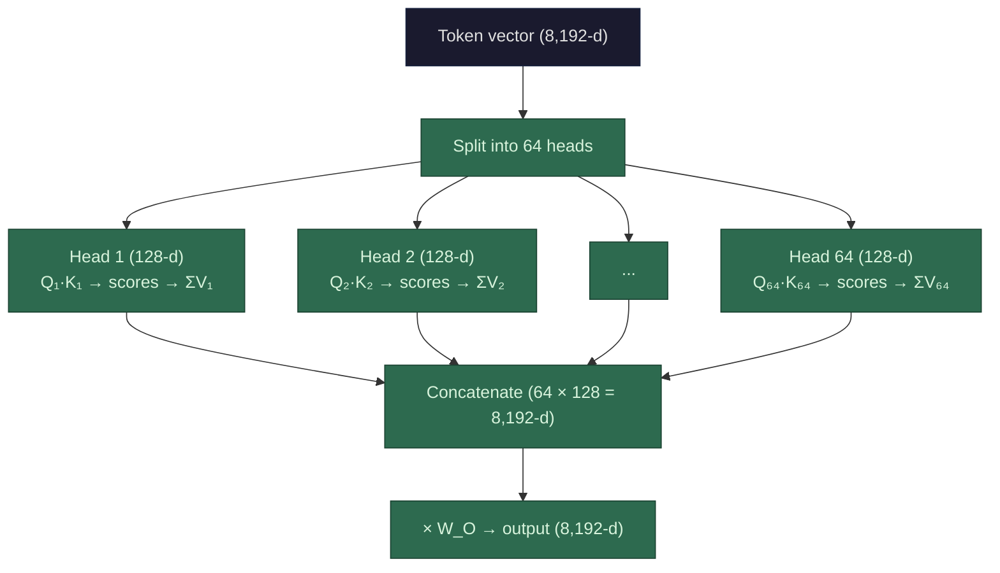

**How multi-head splits the work.** Say `d_model` = 8,192 and you have 64 attention heads. Instead of running one attention operation across all 8,192 dimensions, you split the vector into 64 chunks of 128 dimensions each (`d_head` = 8,192 / 64 = 128). Each head gets its own W_Q, W_K, W_V weight matrices that project into its 128-d subspace. Each head independently computes the full attention operation — T² pairwise dot products, softmax, weighted sum — but in 128 dimensions instead of 8,192. Then the 64 outputs (each 128-d) get concatenated back into one 8,192-d vector and multiplied by one final output projection matrix, `W_O`.

**Why this is better than single-head.** With single-head attention, each token produces one set of attention weights — one probability distribution over all other tokens. "Sat" has to decide: do I attend to "cat" (my subject) or "mat" (my location) or "the" (syntactic context)? It can split the probability across them, but it's one compromise distribution. With 64 heads, head 12 might learn to handle subject-verb relationships, head 37 might handle spatial/prepositional relationships, head 5 might track syntactic structure. Each head can attend 100% to what it cares about — no compromise.

Researchers have observed this specialization empirically. When you visualize attention patterns across heads, different heads show clearly different behaviors: some attend to the previous token, some attend to the first token, some track long-range dependencies, some follow syntactic arcs.

**Now let's run the math.** We'll use a Llama 3 70B-class model and pin everything to a single B200 GPU.

Model config:
- `d_model` = 8,192
- `L` = 80 layers
- `H` = 64 heads
- `d_head` = 128
- B200: ~2,250 TFLOPS FP16 dense, 192 GB HBM3e, ~8 TB/s memory bandwidth

**Per-layer attention FLOPs (these are the same for single-head and multi-head):**

The surprising thing: **total FLOPs are identical** whether you use 1 head or 64 heads. Multi-head doesn't cost more compute — it reorganizes the same compute into parallel independent operations.

Here's why. The projection step (creating Q, K, V) involves multiplying each token by a `d_model × d_model` matrix regardless — whether that's one big matrix or 64 smaller ones that together cover the same dimensions, the total multiply-adds are the same. The attention score computation does T² dot products per head, but each in `d_head` dimensions: `H × T² × d_head = T² × (H × d_head) = T² × d_model` — same total as one head doing T² dot products in `d_model` dimensions.

The per-layer breakdown:

| Operation | Formula | T = 4,096 | T = 100,000 |
|-----------|---------|-----------|-------------|
| QKV projections (3 matrices) | 3 × 2 × T × d_model² | 1.65 TFLOP | 40.3 TFLOP |
| Output projection (1 matrix) | 2 × T × d_model² | 0.55 TFLOP | 13.4 TFLOP |
| Attention scores (Q·K^T) | 2 × T² × d_model | 0.27 TFLOP | 163.8 TFLOP |
| Weighted sum (scores × V) | 2 × T² × d_model | 0.27 TFLOP | 163.8 TFLOP |
| **Per-layer total** | | **2.74 TFLOP** | **381.3 TFLOP** |

Look at the shift. At T=4,096, projections dominate (80% of compute). At T=100,000, attention scores dominate (86%). This is the T² crossover in action.

**Full model prefill (80 layers):**

| | T = 4,096 | T = 100,000 |
|---|-----------|-------------|
| Total FLOPs | 219 TFLOP | 30,504 TFLOP |
| Time on B200 (FP16, theoretical peak) | ~0.1 sec | ~13.6 sec |
| Realistic (50-70% utilization) | ~0.15-0.2 sec | ~19-27 sec |

(Note: this is attention only — the feed-forward layers add roughly the same amount again, so double these for the full model. The point is the scaling behavior.)

**Where multi-head DOES change the cost: memory.**

Each head produces its own T × T attention score matrix. These need to exist simultaneously during computation:

| | Single-head | 64 heads |
|---|------------|----------|
| Attention score memory | T² × 2 bytes | 64 × T² × 2 bytes |
| At T = 4,096 | 33 MB | 2.1 GB |
| At T = 100,000 | 20 GB | **1.28 TB** |

At T=100,000 with 64 heads, the attention score matrices alone would need 1.28 TB — **6.7× the B200's entire 192 GB of HBM**. And that's for *one layer*. This is why **FlashAttention** was invented: it computes attention in tiles, never materializing the full T×T matrix in memory. Instead of storing all scores, it processes them in blocks, computing softmax incrementally. FlashAttention makes long-context multi-head attention feasible on real hardware — without it, you'd need to either drastically reduce sequence length or find a GPU with terabytes of memory.

**KV cache impact (multi-head vs. single-head):**

The KV cache stores K and V vectors — these are `d_model`-dimensional total regardless of head count, so the KV cache size is the same for single-head and multi-head:

`T × L × 2 × d_model × 2 bytes`

| Sequence length | KV cache (80 layers, d=8,192, FP16) | % of B200 HBM (192 GB) |
|----------------|--------------------------------------|------------------------|
| 4,096 | 10.7 GB | 5.6% |
| 32,000 | 83.9 GB | 43.7% |
| 100,000 | 262 GB | **136% — doesn't fit** |

This is where **[Grouped-Query Attention](/llms/what-happens/prefill-decode/kv-cache/mqa-gqa/) (GQA)** comes in — a compromise between full multi-head and the extreme of Multi-Query Attention (MQA, which uses just 1 shared K/V head). GQA groups the 64 query heads into, say, 8 groups, sharing one set of K/V across each group. This cuts the [KV cache](/llms/what-happens/prefill-decode/kv-cache/) by 8× while retaining most of multi-head's expressiveness:

| Attention type | KV heads | KV cache at T=100K | Fits in B200? |
|---------------|----------|-------------------|---------------|
| Multi-Head (MHA) | 64 | 262 GB | No |
| Grouped-Query (GQA, 8 groups) | 8 | 32.8 GB | Yes |
| Multi-Query (MQA) | 1 | 4.1 GB | Easily |

Llama 3 70B uses GQA with 8 KV heads. This is a direct architectural response to the memory pressure from long-context KV caches — and it's why the distinction matters for real-world deployment.

**Bottom line:** Multi-head attention doesn't cost more FLOPs than single-head — it costs the same total compute, reorganized for expressiveness. The real costs are in memory: the [attention score](/llms/what-happens/embeddings/model-layers/attention-deep-dive/) matrices (solved by FlashAttention) and the KV cache (mitigated by GQA/MQA). At long sequence lengths, these memory costs — not compute — are what determine whether a model can actually run on real hardware.
