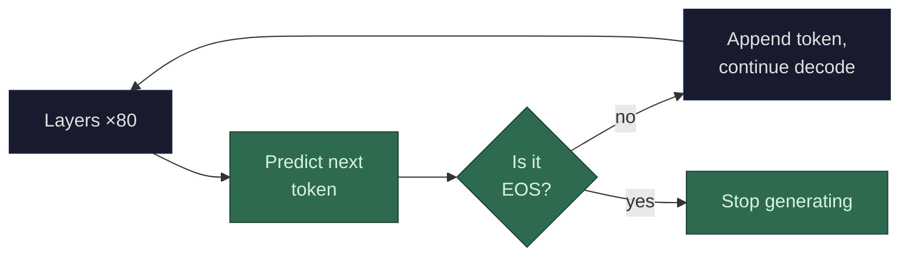

The model doesn't "decide" it has fully answered your question. It has no concept of completeness, correctness, or satisfaction. It stops because it predicts a special token.

**The EOS token.** Every model's vocabulary includes one or more special tokens that signal "end of sequence" — commonly called `<EOS>`, `<|endoftext|>`, `</s>`, or similar. These tokens are in the vocabulary alongside "the", "cat", and every other token. When the model's final hidden state gets dot-producted against the vocabulary (see [token prediction](/llms/what-happens/embeddings/model-layers/final-vector-to-token/)), the EOS token competes with every other token for the highest probability. When EOS wins — when the model predicts that the most likely next token is "stop" — generation ends.

**How did it learn when to stop?** The same way it learned everything else: training data. The training corpus is segmented into sequences, each ending with an EOS token. The model learned, through trillions of gradient updates, that certain patterns precede EOS — a complete thought, a finished answer, the end of a paragraph, a natural stopping point. During fine-tuning and RLHF, the model further learned that in a conversation context, EOS should come after a complete, helpful response — not mid-sentence and not after excessive rambling.

**What it looks like mechanically:** at every decode step, the softmax over the vocabulary produces a probability for EOS alongside every other token. Early in a response, EOS probability is near zero — the model is mid-thought. As the response progresses and the model approaches a natural endpoint, EOS probability climbs. Eventually it becomes the highest-probability token, gets selected, and generation stops.

**Other stopping conditions** exist outside the model:
- **Max token limit**: the serving system can impose a hard cap. Even if the model hasn't predicted EOS, generation stops at the limit. The model didn't "decide" to stop — it was cut off.
- **Stop sequences**: the API can specify text patterns (like `"\n\nHuman:"`) that trigger an immediate stop when generated. Again, external — the model doesn't know about these.
- **[Context window](/llms/what-happens/prefill-decode/kv-cache/) exhaustion**: if the generated tokens plus the input fill the model's maximum context length, generation must stop because there's no room for another token.

**The model has no self-awareness about stopping.** It doesn't think "I've fully answered this question." It doesn't evaluate its own response for completeness. It simply predicts the next token, and sometimes that next token is EOS. The *appearance* of knowing when to stop comes entirely from the statistical patterns in the training data — the model learned what complete responses look like by seeing millions of them.

**Performance profile:** Predicting the EOS token is mechanically identical to predicting any other token — same forward pass through all 80 layers, same vocabulary [dot product](/llms/what-happens/vectors/dot-product/), same cost. There is no special "checking" computation. The only performance relevance is that models which tend to be verbose (low EOS probability until very long responses) cost more per request purely because they generate more tokens before stopping.
