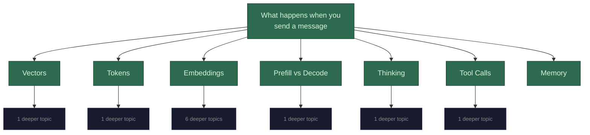

```mermaid
graph TD
    R0["What happens when you<br/>send a message"]:::node
    R0 --> 1a["Vectors"]:::node
    R0 --> 1b["Tokens"]:::node
    R0 --> 1c["Embeddings"]:::node
    R0 --> 1d["Prefill vs Decode"]:::node
    R0 --> 1e["Thinking"]:::node
    R0 --> 1f["Tool Calls"]:::node
    R0 --> 1g["Memory"]:::node

    1a --> 1a_more["1 deeper topic"]:::count
    1b --> 1b_more["1 deeper topic"]:::count
    1c --> 1c_more["6 deeper topics"]:::count
    1d --> 1d_more["1 deeper topic"]:::count
    1e --> 1e_more["1 deeper topic"]:::count
    1f --> 1f_more["1 deeper topic"]:::count

    classDef node fill:#2d6a4f,stroke:#1b4332,color:#d8f3dc
    classDef count fill:#1a1a2e,stroke:#16213e,color:#888,font-size:12px

    click R0 "/llms/what-happens/"
    click 1a "/llms/what-happens/vectors/"
    click 1b "/llms/what-happens/tokens/"
    click 1c "/llms/what-happens/embeddings/"
    click 1d "/llms/what-happens/prefill-decode/"
    click 1e "/llms/what-happens/thinking/"
    click 1f "/llms/what-happens/tool-calls/"
    click 1g "/llms/what-happens/memory/"
```
