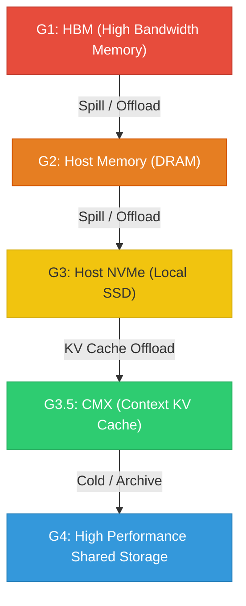

I've spent a lot of time in the last decade+ maintaining a website/blog. I've been maintaining the website for different reasons over the years, at the beginning of my career I would share a lot of operational things that I ran into that I thought other people would find value in, then it shifted into a place where I would dig deep into technical concepts that are more complex, then it became somewhere where I would more or less be a corporate shill. Never once has it truly represented me as a whole person. So we're going to give this thing a fresh go.

The site has been built on Jekyll since 2010, the content has been wiped or lost many times as I've poorly managed migrations to different hosting providers, but it has always been statically rendered by Jekyll. (note: I did have a short affair with Ghost, which I regret.) In this rebuild I've taken the chance to move to Hugo which has quite a bit more flexibility than Jekyll and isn't written in Ruby, which I hate writing.

This won't be a blog post centered around this being a new blog, instead it will be a post that focuses on what this site will be going forward. 

Anyone who has followed me on LinkedIn or knows me personally probably knows that I've returned to NVIDIA in March 2026. I spent the last year and a half working at Lightbeam where I was operating as a product marketing manager - which just isn't the right role for me, it's not technical or deep enough. That doesn't negate the experience as it gave me a much broader understanding of the companies that I work inside of, but it made glaringly obvious my weak points and my strengths. Without a technical challenge, my brain had a hard time remaining engaged each day. 

Fast forward to today and I am now a Sr. TME on the DGX Platform team at NVIDIA. So that giant rack-scale AI infrastructure is the thing that I spend each day trying to wrap my head around, learn, and improve. I will be primarily focusing on the CMX/STX systems, which are the storage reference designs for both AI context KV cache and for high performance storage (tiers g3.5 and g4 respectively).

My head is still a blur from all of the reading and learning I've done in the last few weeks. As a part of that onboarding though, I needed to truly learn how LLMs function. Through this process it made it glaringly obvious how important it is that we make it __way more__ efficient to store the KV cache of LLM conversations. There's a deep dive description of how and why this is necessary if you check out my [series about LLMs](/llms/), which is a deep dive into LLM inference. I did the standard Wes thing, where I started with one simple explanation of the system, then pulled on every single thread, following every rabbit hole. The series will expand over time, so keep an eye on it.

## Beyond Tech

I have so many interests that go far beyond tech. Namely woodworking. I spend a lot of time woodworking and hope to eventually graduate from tech and own a forest and start my own sawmill, focused on regenerative felling and forest management techniques. This website will cover all of my interests, follow many rabbit holes, and often be a way to think through and explore complex topics through the [Series](/series/) section.

Covering my interests beyond technology also means there will be mentions of politics, inequality, and likely some swearing every now and then. My goal here is to express myself freely. As such I'll be adding this disclaimer at the footer of my website:

> All content on this website is 100% reflective of the personal view of Wes Kennedy and is not the views of my employer, NVIDIA.

## Welcome

I'm glad you're here. I hope you find the content on this site useful. All blog posts are 100% written by me, no AI involved. The series are written using Claude Opus but heavily, __heavily__ edited. I do everything I can to represent things accurately, but I am human and I make mistakes. I'm happy to be told I'm wrong and will happily update content appropriately. Simply email me: `wk` at this domain.

<3