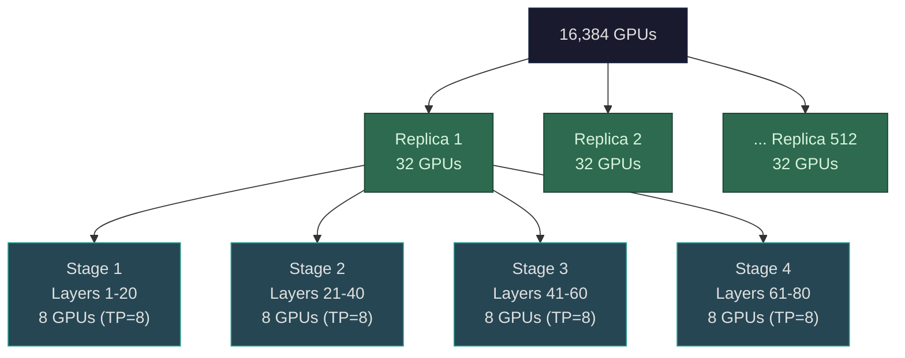

Before walking through the seven phases of a training step, we need a shared vocabulary. The terms below get mixed up constantly — "GPU" and "replica" are not the same thing, "batch" means three different things depending on context, and the difference matters every time you calculate throughput, memory, or communication cost.

The worked example below uses Llama 3 70B on 16,384 H100 GPUs with TP=8, PP=4, DP=512. These numbers are illustrative — Meta has not published the exact parallelism configuration — but they show how the units relate.

## GPU

One physical accelerator. An NVIDIA H100 with 80GB of HBM3. The cluster has **16,384 GPUs** total.

## Node

A server containing multiple GPUs. A DGX H100 node has 8 GPUs connected by NVLink. The 8 GPUs inside one node can communicate at 900 GB/s (NVLink 4.0) — roughly 7x faster than the inter-node InfiniBand links.

16,384 GPUs / 8 GPUs per node = **2,048 nodes** (227 racks of ~9 nodes each).

## Tensor-parallel group

A set of GPUs that collectively compute one layer by splitting its matrix operations. **TP=8** means 8 GPUs share every layer's computation — the massive FFN weight matrices (8,192 × 28,672) are sliced column-wise or row-wise across the group, and partial results are combined via all-reduce after each operation.

Tensor-parallel communication happens *inside every layer, multiple times per layer*, so it must ride NVLink. Putting tensor parallelism on InfiniBand would cut throughput in half. In practice, the tensor-parallel group maps exactly to one NVLink domain — one DGX node.

## Pipeline stage

A group of GPUs (already tensor-parallel) that owns a contiguous subset of the model's layers. **PP=4** means the 80 transformer layers are divided into 4 stages of 20 layers each. Each stage is one tensor-parallel group — 8 GPUs.

During the forward pass, stage 1 processes its 20 layers and ships the activation tensor to stage 2 over InfiniBand, which processes its 20 layers and ships to stage 3, and so on. The backward pass reverses the flow. The pipeline bubble — GPUs idling while waiting for activations or gradients from adjacent stages — is the main cost of pipeline parallelism.

One pipeline stage = **8 GPUs**.

## Model-parallel group

One complete logical copy of the model — all pipeline stages combined. This is the minimum set of GPUs needed to hold and compute the full 70B-parameter model.

TP × PP = 8 × 4 = **32 GPUs per model-parallel group**.

These 32 GPUs span 4 nodes (one tensor-parallel group per pipeline stage). They work together on the same data, passing activations and gradients between stages.

## Data-parallel replica

One model-parallel group that processes its own independent slice of the training data. Every replica holds a full copy of the model (distributed across its 32 GPUs) and sees different training examples. The replicas operate independently during the forward and backward passes, and synchronize only during gradient sync (Phase 5).

16,384 total GPUs / 32 GPUs per replica = **512 data-parallel replicas**.

This is the number that matters for batch size calculations. Not 16,384 GPUs — 512 replicas.

## Micro-batch

The chunk of data one data-parallel replica processes in a single forward/backward pass. Example:

4 sequences × 8,192 tokens per sequence = **32,768 tokens per micro-batch**

At 4 bytes per token ID (32-bit integers for a 128K vocabulary), that's ~128KB of raw input data. Tiny compared to the compute it triggers.

## Gradient accumulation steps

The number of micro-batches a replica processes sequentially before performing an optimizer step. With **accumulation = 4**, each replica runs 4 forward/backward passes, summing gradients locally after each one. The gradients accumulate in place — the gradient buffer stays the same size as the model (70B parameters), regardless of how many micro-batches contribute to it.

Gradient accumulation lets you increase the effective batch size without increasing memory. The memory cost per micro-batch stays constant; you just run more of them before updating weights.

## Global batch

The total tokens consumed per optimizer step across the entire cluster:

> micro-batch tokens × accumulation steps × DP replicas

32,768 × 4 × 512 = **67,108,864 tokens** (~67M tokens per step)

However, Meta reportedly used roughly **4 million tokens per global batch** for Llama 3 70B. That implies a different configuration — perhaps fewer accumulation steps, smaller micro-batches, or a different parallelism layout. The exact setup is not public. The point is understanding how the dimensions multiply, not matching Meta's exact config.

At 4M tokens per step: 15 trillion training tokens / 4M tokens per step ≈ **3.75 million optimizer steps**.

## Optimizer step

One weight update. This is the atomic unit of learning. It happens after:
1. Each replica processes its micro-batches (forward + backward for each)
2. Gradients are accumulated locally across micro-batches
3. Gradients are synchronized across all 512 data-parallel replicas via all-reduce
4. The optimizer (AdamW) uses the averaged gradients plus its running statistics to compute and apply the weight update

After the optimizer step, all 512 replicas have identical weights again. One step complete. Repeat 3.75 million times.

## Summary

| Unit | Count | Size | Key relationship |
|------|-------|------|-----------------|
| GPU | 16,384 | 1 H100 | Physical accelerator |
| Node | 2,048 | 8 GPUs | NVLink domain |
| Tensor-parallel group | 2,048 | 8 GPUs (TP=8) | Splits each layer's matrices |
| Pipeline stage | 2,048 | 8 GPUs (= 1 TP group) | Owns 20 of 80 layers |
| Model-parallel group | 512 | 32 GPUs (TP=8 × PP=4) | One full model copy |
| Data-parallel replica | 512 | 32 GPUs | Independent data, syncs gradients |
| Micro-batch | 512 per fwd/bwd | ~33K tokens | One replica's input per pass |
| Gradient accumulation | 4 steps | — | Micro-batches before sync |
| Global batch | 1 per optimizer step | ~4M tokens | All replicas × all accumulation |
| Optimizer step | ~3.75M total | — | One weight update |

## Visual hierarchy

The numbers in this reference (TP=8, PP=4, DP=512) are illustrative. Meta has not published the exact parallelism configuration for Llama 3 70B. The key point is understanding how these dimensions multiply to fill the cluster, and why the distinction between "GPU" and "data-parallel replica" matters for every calculation that follows.
