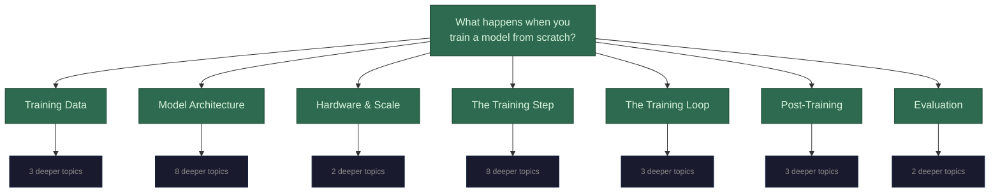

```mermaid
graph TD
    R0["What happens when you<br/>train a model from scratch?"]:::node
    R0 --> 1a["Training Data"]:::node
    R0 --> 1b["Model Architecture"]:::node
    R0 --> 1c["Hardware & Scale"]:::node
    R0 --> 1d["The Training Step"]:::node
    R0 --> 1e["The Training Loop"]:::node
    R0 --> 1f["Post-Training"]:::node
    R0 --> 1g["Evaluation"]:::node

    1a --> 1a_more["3 deeper topics"]:::count
    1b --> 1b_more["8 deeper topics"]:::count
    1c --> 1c_more["2 deeper topics"]:::count
    1d --> 1d_more["8 deeper topics"]:::count
    1e --> 1e_more["3 deeper topics"]:::count
    1f --> 1f_more["3 deeper topics"]:::count
    1g --> 1g_more["2 deeper topics"]:::count

    classDef node fill:#2d6a4f,stroke:#1b4332,color:#d8f3dc
    classDef count fill:#1a1a2e,stroke:#16213e,color:#888,font-size:12px

    click R0 "/series/training/train-from-scratch/"
    click 1a "/series/training/train-from-scratch/training-data/"
    click 1b "/series/training/train-from-scratch/model-architecture/"
    click 1c "/series/training/train-from-scratch/hardware-and-scale/"
    click 1d "/series/training/train-from-scratch/training-step/"
    click 1e "/series/training/train-from-scratch/training-loop/"
    click 1f "/series/training/train-from-scratch/post-training/"
    click 1g "/series/training/train-from-scratch/evaluation/"
```
